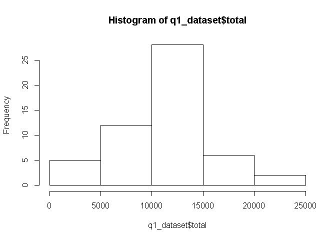
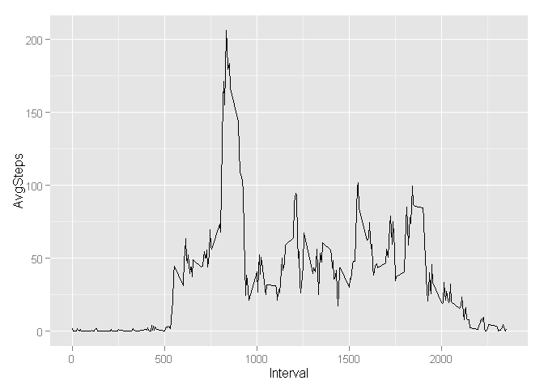
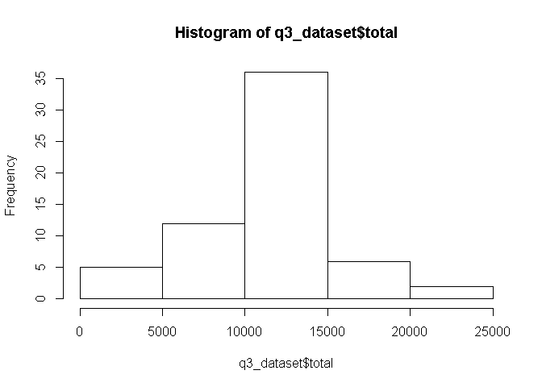
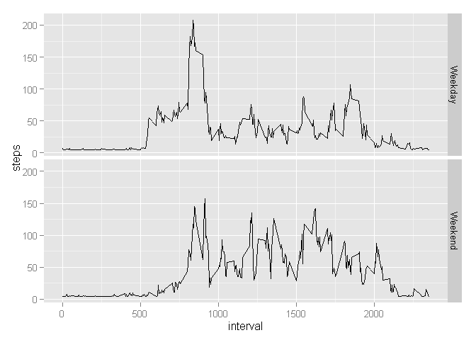

# Reproducible Data: Week 2 Assignment

Loading and preprocessing the data


```r
setwd('C:/Users/Allen/Google Drive/Coursera/Reproducible Data/Week 2/Assignment/data')
dat<-read.csv('activity.csv')
dat_original<-read.csv('activity.csv')
dat<-na.omit(dat)
```


**Question 1:**
What is mean total number of steps taken per day?


```r
totalStepsPerDay<-aggregate(dat$steps,by=list(dat$date),FUN='sum')

meanStepsPerDay<-aggregate(dat$steps,by=list(dat$date),FUN='mean')

q1_dataset<-merge(totalStepsPerDay,meanStepsPerDay,by.x='Group.1', by.y='Group.1')

medianStepsPerDay<-aggregate(dat$steps,by=list(dat$date),FUN='median')

q1_dataset<-merge(q1_dataset,medianStepsPerDay,by.x='Group.1', by.y='Group.1')

colnames(q1_dataset)<-c('date','total','mean','median')
```


Histogram of Total Steps Per Day


```r
hist(q1_dataset$total)
```

 


Total, Mean, and Median by Date Report


```r
print(q1_dataset)
```

```
##          date total       mean median
## 1  2012-10-02   126  0.4375000      0
## 2  2012-10-03 11352 39.4166667      0
## 3  2012-10-04 12116 42.0694444      0
## 4  2012-10-05 13294 46.1597222      0
## 5  2012-10-06 15420 53.5416667      0
## 6  2012-10-07 11015 38.2465278      0
## 7  2012-10-09 12811 44.4826389      0
## 8  2012-10-10  9900 34.3750000      0
## 9  2012-10-11 10304 35.7777778      0
## 10 2012-10-12 17382 60.3541667      0
## 11 2012-10-13 12426 43.1458333      0
## 12 2012-10-14 15098 52.4236111      0
## 13 2012-10-15 10139 35.2048611      0
## 14 2012-10-16 15084 52.3750000      0
## 15 2012-10-17 13452 46.7083333      0
## 16 2012-10-18 10056 34.9166667      0
## 17 2012-10-19 11829 41.0729167      0
## 18 2012-10-20 10395 36.0937500      0
## 19 2012-10-21  8821 30.6284722      0
## 20 2012-10-22 13460 46.7361111      0
## 21 2012-10-23  8918 30.9652778      0
## 22 2012-10-24  8355 29.0104167      0
## 23 2012-10-25  2492  8.6527778      0
## 24 2012-10-26  6778 23.5347222      0
## 25 2012-10-27 10119 35.1354167      0
## 26 2012-10-28 11458 39.7847222      0
## 27 2012-10-29  5018 17.4236111      0
## 28 2012-10-30  9819 34.0937500      0
## 29 2012-10-31 15414 53.5208333      0
## 30 2012-11-02 10600 36.8055556      0
## 31 2012-11-03 10571 36.7048611      0
## 32 2012-11-05 10439 36.2465278      0
## 33 2012-11-06  8334 28.9375000      0
## 34 2012-11-07 12883 44.7326389      0
## 35 2012-11-08  3219 11.1770833      0
## 36 2012-11-11 12608 43.7777778      0
## 37 2012-11-12 10765 37.3784722      0
## 38 2012-11-13  7336 25.4722222      0
## 39 2012-11-15    41  0.1423611      0
## 40 2012-11-16  5441 18.8923611      0
## 41 2012-11-17 14339 49.7881944      0
## 42 2012-11-18 15110 52.4652778      0
## 43 2012-11-19  8841 30.6979167      0
## 44 2012-11-20  4472 15.5277778      0
## 45 2012-11-21 12787 44.3993056      0
## 46 2012-11-22 20427 70.9270833      0
## 47 2012-11-23 21194 73.5902778      0
## 48 2012-11-24 14478 50.2708333      0
## 49 2012-11-25 11834 41.0902778      0
## 50 2012-11-26 11162 38.7569444      0
## 51 2012-11-27 13646 47.3819444      0
## 52 2012-11-28 10183 35.3576389      0
## 53 2012-11-29  7047 24.4687500      0
```


**Question 2:**
Graph of AVG Daily Activity Pattern


```r
library(ggplot2)
q2_dataset<-aggregate(dat$steps,by=list(dat$interval),mean)
colnames(q2_dataset)<-c('Interval','AvgSteps')
ggplot(q2_dataset, aes(Interval, AvgSteps))+geom_line()
```

 

Interval with the Highest AVG Steps


```r
q2_dataset[q2_dataset$AvgSteps==max(q2_dataset$AvgSteps),]
```

```
##     Interval AvgSteps
## 104      835 206.1698
```

**Question 3: **
Imputing missing values

Number of NA's


```r
sum(is.na(dat_original$steps))
```

```
## [1] 2304
```

Use overall mean as the NAs


```r
dat_original$steps[is.na(dat_original$steps)] <- mean(dat$steps)

totalStepsPerDay_q3<-aggregate(dat_original$steps,by=list(dat_original$date),FUN='sum')

meanStepsPerDay_q3<-aggregate(dat_original$steps,by=list(dat_original$date),FUN='mean')

q3_dataset<-merge(totalStepsPerDay_q3,meanStepsPerDay_q3,by.x='Group.1', by.y='Group.1')

medianStepsPerDay_q3<-aggregate(dat_original$steps,by=list(dat_original$date),FUN='median')

q3_dataset<-merge(q3_dataset,medianStepsPerDay_q3,by.x='Group.1', by.y='Group.1')

colnames(q3_dataset)<-c('date','total','mean','median')
```

Histogram of Total Steps Per Day


```r
hist(q3_dataset$total)
```

 


Total, Mean, and Median by Date Report After Imputing Missing Values


```r
q3_dataset_final<-merge(q3_dataset,q1_dataset,by.x='date',by.y='date',all.x=TRUE)
colnames(q3_dataset_final)<-c('date','tot_incl_na','mean_incl_na','med_incl_na','tot_no_na','mean_no_na','med_no_na')
q3_dataset_final$tot_incl_na<-round(q3_dataset_final$tot_incl_na,3)
q3_dataset_final$mean_incl_na<-round(q3_dataset_final$mean_incl_na,3)
q3_dataset_final$med_incl_na<-round(q3_dataset_final$med_incl_na,3)
q3_dataset_final$tot_no_na<-round(q3_dataset_final$tot_no_na,3)
q3_dataset_final$mean_no_na<-round(q3_dataset_final$mean_no_na,3)
q3_dataset_final$med_no_na<-round(q3_dataset_final$med_no_na,3)
q3_dataset_final$totDifference<-q3_dataset_final$tot_incl_na-q3_dataset_final$tot_no_na
print(q3_dataset_final)
```

```
##          date tot_incl_na mean_incl_na med_incl_na tot_no_na mean_no_na
## 1  2012-10-01    10766.19       37.383      37.383        NA         NA
## 2  2012-10-02      126.00        0.438       0.000       126      0.438
## 3  2012-10-03    11352.00       39.417       0.000     11352     39.417
## 4  2012-10-04    12116.00       42.069       0.000     12116     42.069
## 5  2012-10-05    13294.00       46.160       0.000     13294     46.160
## 6  2012-10-06    15420.00       53.542       0.000     15420     53.542
## 7  2012-10-07    11015.00       38.247       0.000     11015     38.247
## 8  2012-10-08    10766.19       37.383      37.383        NA         NA
## 9  2012-10-09    12811.00       44.483       0.000     12811     44.483
## 10 2012-10-10     9900.00       34.375       0.000      9900     34.375
## 11 2012-10-11    10304.00       35.778       0.000     10304     35.778
## 12 2012-10-12    17382.00       60.354       0.000     17382     60.354
## 13 2012-10-13    12426.00       43.146       0.000     12426     43.146
## 14 2012-10-14    15098.00       52.424       0.000     15098     52.424
## 15 2012-10-15    10139.00       35.205       0.000     10139     35.205
## 16 2012-10-16    15084.00       52.375       0.000     15084     52.375
## 17 2012-10-17    13452.00       46.708       0.000     13452     46.708
## 18 2012-10-18    10056.00       34.917       0.000     10056     34.917
## 19 2012-10-19    11829.00       41.073       0.000     11829     41.073
## 20 2012-10-20    10395.00       36.094       0.000     10395     36.094
## 21 2012-10-21     8821.00       30.628       0.000      8821     30.628
## 22 2012-10-22    13460.00       46.736       0.000     13460     46.736
## 23 2012-10-23     8918.00       30.965       0.000      8918     30.965
## 24 2012-10-24     8355.00       29.010       0.000      8355     29.010
## 25 2012-10-25     2492.00        8.653       0.000      2492      8.653
## 26 2012-10-26     6778.00       23.535       0.000      6778     23.535
## 27 2012-10-27    10119.00       35.135       0.000     10119     35.135
## 28 2012-10-28    11458.00       39.785       0.000     11458     39.785
## 29 2012-10-29     5018.00       17.424       0.000      5018     17.424
## 30 2012-10-30     9819.00       34.094       0.000      9819     34.094
## 31 2012-10-31    15414.00       53.521       0.000     15414     53.521
## 32 2012-11-01    10766.19       37.383      37.383        NA         NA
## 33 2012-11-02    10600.00       36.806       0.000     10600     36.806
## 34 2012-11-03    10571.00       36.705       0.000     10571     36.705
## 35 2012-11-04    10766.19       37.383      37.383        NA         NA
## 36 2012-11-05    10439.00       36.247       0.000     10439     36.247
## 37 2012-11-06     8334.00       28.938       0.000      8334     28.938
## 38 2012-11-07    12883.00       44.733       0.000     12883     44.733
## 39 2012-11-08     3219.00       11.177       0.000      3219     11.177
## 40 2012-11-09    10766.19       37.383      37.383        NA         NA
## 41 2012-11-10    10766.19       37.383      37.383        NA         NA
## 42 2012-11-11    12608.00       43.778       0.000     12608     43.778
## 43 2012-11-12    10765.00       37.378       0.000     10765     37.378
## 44 2012-11-13     7336.00       25.472       0.000      7336     25.472
## 45 2012-11-14    10766.19       37.383      37.383        NA         NA
## 46 2012-11-15       41.00        0.142       0.000        41      0.142
## 47 2012-11-16     5441.00       18.892       0.000      5441     18.892
## 48 2012-11-17    14339.00       49.788       0.000     14339     49.788
## 49 2012-11-18    15110.00       52.465       0.000     15110     52.465
## 50 2012-11-19     8841.00       30.698       0.000      8841     30.698
## 51 2012-11-20     4472.00       15.528       0.000      4472     15.528
## 52 2012-11-21    12787.00       44.399       0.000     12787     44.399
## 53 2012-11-22    20427.00       70.927       0.000     20427     70.927
## 54 2012-11-23    21194.00       73.590       0.000     21194     73.590
## 55 2012-11-24    14478.00       50.271       0.000     14478     50.271
## 56 2012-11-25    11834.00       41.090       0.000     11834     41.090
## 57 2012-11-26    11162.00       38.757       0.000     11162     38.757
## 58 2012-11-27    13646.00       47.382       0.000     13646     47.382
## 59 2012-11-28    10183.00       35.358       0.000     10183     35.358
## 60 2012-11-29     7047.00       24.469       0.000      7047     24.469
## 61 2012-11-30    10766.19       37.383      37.383        NA         NA
##    med_no_na totDifference
## 1         NA            NA
## 2          0             0
## 3          0             0
## 4          0             0
## 5          0             0
## 6          0             0
## 7          0             0
## 8         NA            NA
## 9          0             0
## 10         0             0
## 11         0             0
## 12         0             0
## 13         0             0
## 14         0             0
## 15         0             0
## 16         0             0
## 17         0             0
## 18         0             0
## 19         0             0
## 20         0             0
## 21         0             0
## 22         0             0
## 23         0             0
## 24         0             0
## 25         0             0
## 26         0             0
## 27         0             0
## 28         0             0
## 29         0             0
## 30         0             0
## 31         0             0
## 32        NA            NA
## 33         0             0
## 34         0             0
## 35        NA            NA
## 36         0             0
## 37         0             0
## 38         0             0
## 39         0             0
## 40        NA            NA
## 41        NA            NA
## 42         0             0
## 43         0             0
## 44         0             0
## 45        NA            NA
## 46         0             0
## 47         0             0
## 48         0             0
## 49         0             0
## 50         0             0
## 51         0             0
## 52         0             0
## 53         0             0
## 54         0             0
## 55         0             0
## 56         0             0
## 57         0             0
## 58         0             0
## 59         0             0
## 60         0             0
## 61        NA            NA
```

**Question 4:**
Weekday vs Weekend


```r
q4_dataset<-dat_original
q4_dataset$weekType<-sapply(q4_dataset$date, function(x) if(weekdays(as.Date(x))=='Saturday'|weekdays(as.Date(x))=='Sunday'){'Weekend'
  }else {
      'Weekday'
    })

q4_dataset_agg<-aggregate(steps~interval+weekType,data=q4_dataset,mean)

ggplot(q4_dataset_agg, aes(interval, steps))+geom_line()+ facet_grid(weekType ~ .)
```

 
